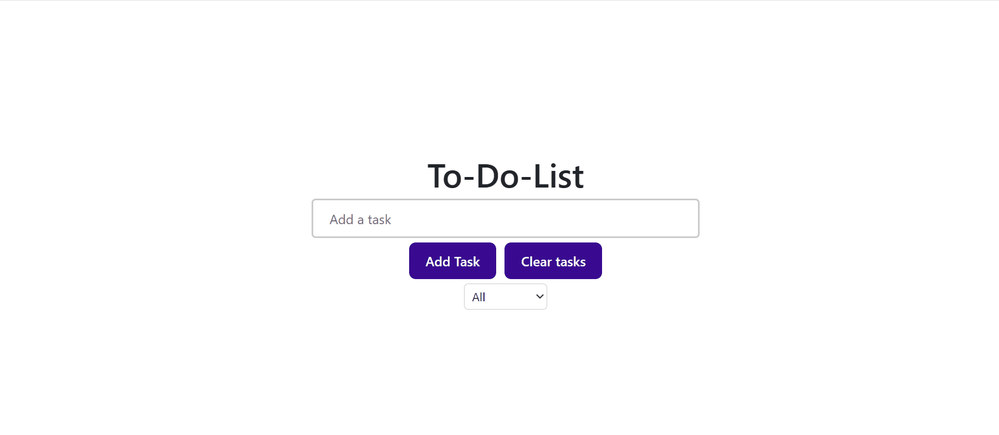

# *To-Do-List*

By: **Joel Jose**

Description: **This is an app that can be used to create a to-do-list for personal use with tasks that can be checked and deleted once they are complete. Type in your task and click the "Add Task" button to add. Click on the edit button to edit the text of a task, and hit Enter to save. Tasks can be filtered based on completion status using the select menu**

## Video Walkthrough

Here's a walkthrough of implemented required features:

GIF created with ScreenToGif

## License

    Copyright [2024] [Joel Jose]

    Licensed under the Apache License, Version 2.0 (the "License");
    you may not use this file except in compliance with the License.
    You may obtain a copy of the License at

        http://www.apache.org/licenses/LICENSE-2.0

    Unless required by applicable law or agreed to in writing, software
    distributed under the License is distributed on an "AS IS" BASIS,
    WITHOUT WARRANTIES OR CONDITIONS OF ANY KIND, either express or implied.
    See the License for the specific language governing permissions and
    limitations under the License.
